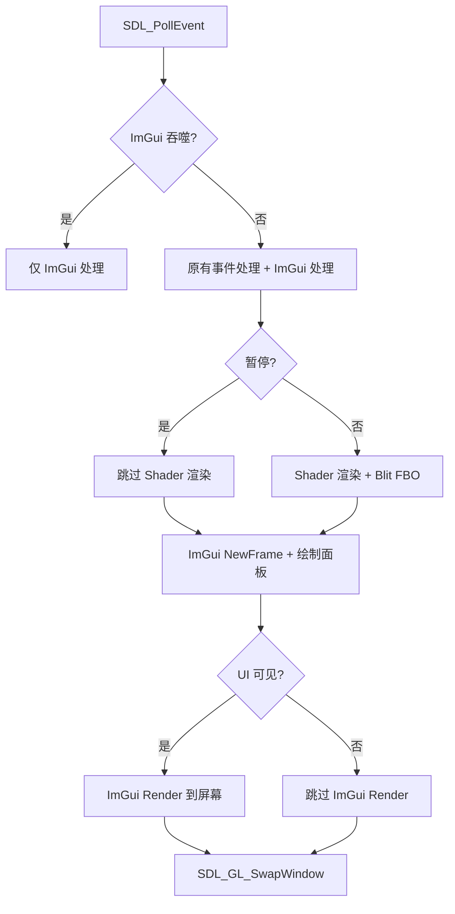
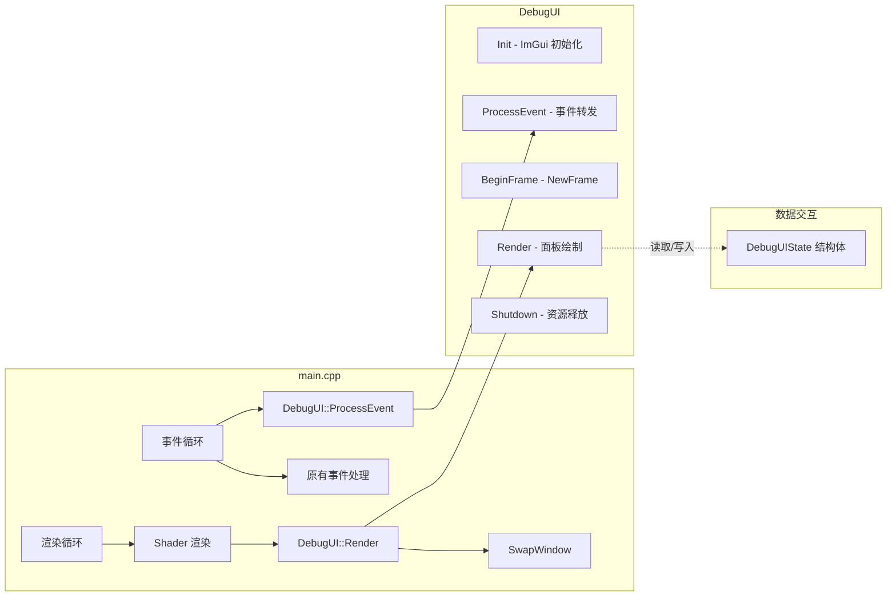

## 产品概述

为 ShaderToy Desktop 的窗口模式添加一个可通过 Tab 键切换显示/隐藏的调试面板（overlay），覆盖在 shader 渲染画面之上，提供实时信息展示、交互控制和 shader 切换功能。

## 核心功能

### 1. 信息展示面板

- **FPS/帧率信息**：当前实时帧率、自适应帧率、目标帧率、帧时间（timeDelta）
- **Shader 状态**：当前 shader 文件路径、编译状态（成功/失败）
- **Uniform 值监控**：iResolution、iTime、iTimeDelta、iFrame、iMouse 等实时值
- **编译错误信息**：shader 编译/链接失败时，以醒目红色文字显示完整错误信息

### 2. 调试控制功能

- **重新加载 Shader**：按钮触发，等同于 F5 手动热加载
- **Shader 切换器**：列出 assets/shaders/ 目录下的所有 .glsl 文件，点击即可切换到对应 shader，当前使用的 shader 高亮标识
- **暂停/恢复渲染**：切换暂停状态，暂停时画面冻结但 UI 面板仍可交互
- **重置时间**：将 iTime 归零，重新开始 shader 动画
- **调节 FPS**：滑条调整目标帧率（15~120）
- **调节 renderScale**：滑条调整渲染分辨率缩放（0.1~1.0）

### 3. 显示控制

- 默认隐藏，按 Tab 键切换显示/隐藏
- 半透明覆盖在 shader 渲染画面左上角
- 仅在窗口模式下生效，壁纸模式不加载 UI

## 技术栈

- 现有：SDL2 (release-2.30.12, 静态链接) + OpenGL 3.3 Core + GLAD + C++17 + CMake (FetchContent)
- 新增：**Dear ImGui** (v1.91.8, docking 分支) — 通过 FetchContent 引入，与项目已有依赖管理方式一致
- 后端：`imgui_impl_sdl2` + `imgui_impl_opengl3`（ImGui 官方 SDL2+GL3.3 标准搭配）

## 实现方案

### 高层策略

将 Dear ImGui 作为 overlay 层集成到现有渲染管线中。在每帧 shader 渲染完成后（blit FBO 之后）、`SDL_GL_SwapWindow` 之前插入 ImGui 渲染调用。通过独立的 `DebugUI` 类封装所有 ImGui 逻辑，通过 `DebugUIState` 结构体与 main.cpp 交互，避免 main.cpp 过度膨胀。

### 关键技术决策

1. **Dear ImGui 引入方式**：使用 FetchContent 从 GitHub 拉取 ImGui 源码（与项目 SDL2/GLAD 管理方式一致）。ImGui 不提供 CMakeLists.txt，需手动将核心源文件 + SDL2/OpenGL3 后端文件加入编译目标。

2. **ImGui 后端选择**：使用官方 `imgui_impl_sdl2.cpp` + `imgui_impl_opengl3.cpp`，这是 SDL2+GL3.3 的标准后端组合，ImGui 源码 `backends/` 目录中自带。

3. **DebugUI 类封装**：`DebugUI` 类封装 Init/ProcessEvent/BeginFrame/Render/Shutdown 方法，main.cpp 只管调用接口。`DebugUIState` 结构体作为数据桥梁，包含只读展示数据和可写控制数据。

4. **暂停状态下仍渲染 UI**：当前暂停逻辑（main.cpp 第593行）直接 `continue` 跳过所有渲染。修改为：暂停时跳过 shader 渲染但仍执行 ImGui 渲染和 SwapWindow，确保面板可交互。

5. **ImGui 事件吞噬**：当 ImGui 面板可见且鼠标/键盘聚焦在 UI 上时，通过 `ImGui::GetIO().WantCaptureMouse/WantCaptureKeyboard` 阻止事件传递给 shader，避免点击 UI 按钮影响 iMouse。

6. **Shader 切换实现**：

- 扫描 `assets/shaders/` 目录获取所有 .glsl 文件列表（使用 C++17 `<filesystem>` 的 `directory_iterator`）
- 在面板中以列表形式展示，当前 shader 高亮
- 点击切换时：更新 `config.shaderPath` → 触发 `shaderNeedsReload` → 热加载逻辑自动生效
- 切换后需停止旧 FileWatcher 并启动新文件监控（调用 `watcher.Watch(newPath, callback)`，Watch 内部已含 Stop）

7. **时间重置实现**：重置 `startTime = SDL_GetPerformanceCounter()` 和 `frameCount = 0`，iTime 自然归零。

8. **FPS/renderScale 动态调节**：修改 `config.targetFPS` 后重置 `adaptiveFPS`；修改 `config.renderScale` 后触发 `useScaledRender` 判断和 FBO 重建。

### 核心数据流



## 实现注意事项

1. **OpenGL 状态恢复**：ImGui 官方 OpenGL3 后端已内置 GL 状态保存/恢复机制，不影响下一帧 shader 渲染。

2. **降分辨率渲染兼容**：ImGui 必须在 blit FBO 到屏幕之后渲染，确保 UI 以原生分辨率绘制，不受 renderScale 影响。渲染顺序：shader(FBO) → blit → ImGui → SwapWindow。

3. **编译错误持久化**：在 main.cpp 的热加载逻辑中维护 `lastShaderError` 字符串，加载失败时保存完整错误信息，成功时清空，传递给 DebugUIState 展示。

4. **Shader 目录扫描**：使用 C++17 `std::filesystem::directory_iterator` 扫描 `assets/shaders/` 目录。在 ImGui 面板打开时执行扫描（或有缓存+手动刷新按钮），避免每帧 IO 开销。

5. **壁纸模式零开销**：通过 `!config.wallpaperMode` 条件，壁纸模式下完全跳过 ImGui 初始化和渲染。

6. **CMake ImGui 集成**：ImGui 不提供官方 CMakeLists.txt，需在 FetchContent 后手动添加源文件列表：`imgui.cpp, imgui_draw.cpp, imgui_tables.cpp, imgui_widgets.cpp, imgui_demo.cpp`（核心）+ `backends/imgui_impl_sdl2.cpp, backends/imgui_impl_opengl3.cpp`（后端）。

## 架构设计



## 目录结构

```
c:/MyGit/ai-ShaderToy/
├── CMakeLists.txt            # [MODIFY] 添加 Dear ImGui FetchContent 声明，
│                             #   添加 imgui 核心 + SDL2/GL3 后端源文件到 SOURCES，
│                             #   添加 imgui include 路径和 backends include 路径
├── src/
│   ├── main.cpp              # [MODIFY] 集成 DebugUI：
│   │                         #   1. 包含 debug_ui.h
│   │                         #   2. 窗口模式下初始化 DebugUI（传入 window + glContext）
│   │                         #   3. 事件循环中先转发事件给 ImGui，再根据 WantCapture 决定是否传递给 shader
│   │                         #   4. Tab 键切换 UI 显隐
│   │                         #   5. 修改暂停逻辑（暂停时仍渲染 UI + SwapWindow）
│   │                         #   6. 每帧填充 DebugUIState 数据，读取 UI 控制结果
│   │                         #   7. shader 切换逻辑：更新 shaderPath + 触发 reload + 更新 FileWatcher
│   │                         #   8. 时间重置逻辑：重置 startTime + frameCount
│   │                         #   9. FPS/renderScale 滑条生效逻辑
│   │                         #   10. 维护 lastShaderError 字符串
│   │                         #   11. 清理时 Shutdown
│   ├── debug_ui.h            # [NEW] DebugUI 类声明 + DebugUIState 结构体
│   │                         #   DebugUIState 包含：
│   │                         #     只读: fps, adaptiveFPS, currentTime, timeDelta, frameCount,
│   │                         #           resolution[2], mouse[4], shaderPath, shaderError
│   │                         #     可写: paused, targetFPS, renderScale
│   │                         #     动作标志: requestReload, requestResetTime, requestSwitchShader(路径)
│   │                         #     shader列表: shaderFiles (vector<string>)
│   │                         #   DebugUI 接口: Init/Shutdown/ProcessEvent/BeginFrame/Render
│   │                         #                 IsVisible/Toggle/SetVisible
│   └── debug_ui.cpp          # [NEW] DebugUI 类实现
│                              #   - Init: 创建 ImGui Context，初始化 SDL2+GL3 后端，
│                              #           配置半透明暗色样式
│                              #   - ProcessEvent: 转发 SDL_Event 给 ImGui_ImplSDL2_ProcessEvent
│                              #   - BeginFrame: ImGui_ImplOpenGL3_NewFrame + SDL2_NewFrame + ImGui::NewFrame
│                              #   - Render: 绘制调试面板（信息区+控制区+shader选择器+错误区）
│                              #            + ImGui::Render + ImGui_ImplOpenGL3_RenderDrawData
│                              #   - Shutdown: 销毁 ImGui 后端和 Context
│                              #   面板布局：
│                              #     - 信息区：FPS/帧时间、shader路径/状态、uniform值
│                              #     - 控制区：Reload按钮、Pause/Resume按钮、Reset Time按钮、
│                              #              FPS滑条、renderScale滑条
│                              #     - Shader选择器：列表展示 .glsl 文件，当前高亮，点击切换
│                              #     - 错误区：红色文字显示编译错误（仅在有错误时显示）
├── ai-readme.md              # [MODIFY] 更新开发阶段进度，添加阶段3
└── Docs/
    └── 使用说明.md             # [MODIFY] 添加 Tab 调试面板使用说明
```

## 关键代码结构

```cpp
/// 调试 UI 需要读写的应用状态（main.cpp 与 DebugUI 之间的数据桥梁）
struct DebugUIState {
    // === 只读信息展示（main.cpp 每帧写入，DebugUI 读取展示） ===
    float fps;                  // 当前实时帧率 (1/timeDelta)
    float adaptiveFPS;          // 自适应帧率
    float currentTime;          // iTime
    float timeDelta;            // iTimeDelta
    int   frameCount;           // iFrame
    float resolution[2];        // iResolution xy
    float mouse[4];             // iMouse xyzw
    const char* shaderPath;     // 当前 shader 路径
    const char* shaderError;    // 最近编译错误（空字符串=无错误）

    // === 可交互控制（DebugUI 修改，main.cpp 读取并应用） ===
    bool  paused;               // 暂停/恢复
    int   targetFPS;            // 目标帧率（滑条 15~120）
    float renderScale;          // 渲染缩放（滑条 0.1~1.0）

    // === 一次性动作标志（DebugUI 置 true，main.cpp 消费后重置） ===
    bool  requestReload;        // 请求重载 shader
    bool  requestResetTime;     // 请求重置时间
    std::string requestSwitchShader; // 非空=请求切换到该路径的 shader

    // === Shader 文件列表（main.cpp 填充，DebugUI 读取展示） ===
    std::vector<std::string> shaderFiles; // assets/shaders/ 下的 .glsl 文件列表
};
```

## Agent Extensions

### SubAgent

- **code-explorer**
- 用途：在实现步骤 1（添加 ImGui 依赖）时，探索 FetchContent 下载后 ImGui 源码的实际目录结构，确认需要编译的源文件路径和 include 目录
- 预期结果：确保 CMakeLists.txt 中的 ImGui 源文件列表和 include 路径准确无误
